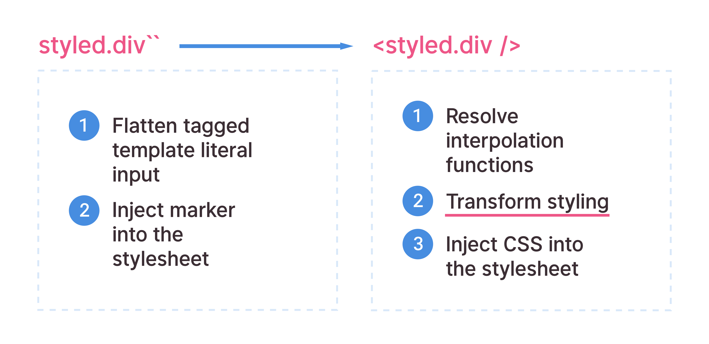
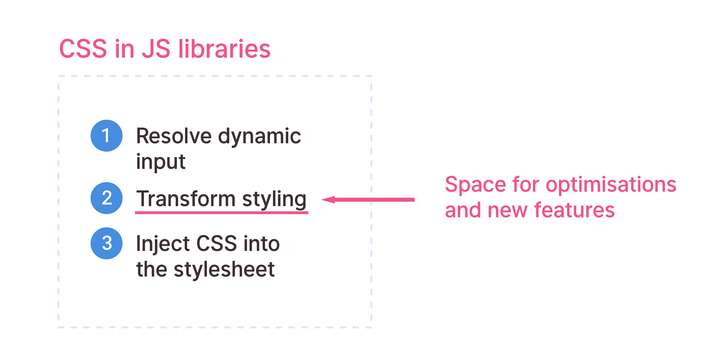
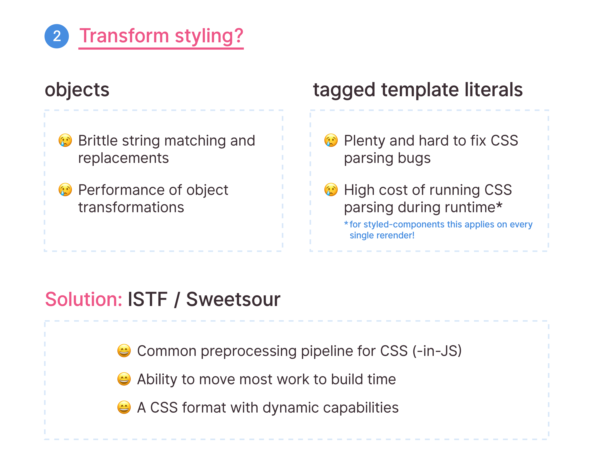

# Motivation

A lot of the motivations behind the Sweetsour project are outlined in [this Medium post.](https://medium.com/styled-components/with-styled-components-into-the-future-d1d917e7c22c)

## Preface

Repeatedly, a tremendous effort has been going into CSS-in-JS libraries, and it's safe to say that libraries like
[styled-components](https://github.com/styled-components/styled-components) are here to stay.
Furthermore the paradigms behind libraries like styled-components have become very popular and the future
of the community depends on these patterns becoming more stable, extensible, and **parseable**.

Specifically a couple of intricate steps go into "tagged template string"-based CSS-in-JS libraries, that
are unlike any usual CSS-in-JS approaches.

## The old architecture

The styled-components architecture, as of now, requires the library to take all tagged template string input,
and evaluate the interpolations and transform the styling on every rerender. This is inherently suboptimal.

This doesn't only apply to styled-components, however.

Most CSS-in-JS libraries face different or similar problems around accepting user input and transforming
it efficiently and safely.

So while this process is slow for a library like styled-components, there are other drawbacks for different
CSS-in-JS libraries.

## The proposed, new architecture

[ISTF](https://github.com/cssinjs/istf-spec) aims to solve all these problems with a single, new approach.
A couple of advantages are listed above; Part of this effort involves parsing the user's CSS-in-JS input
to a different format that is:

- fast & safe to transform
- usable during build- and runtime
- has interpolations (dynamic capabilities) as a first class citizen
- tries to speed up the process of repeated stringification

Another nice pro of this idea is that such a tool would automatically provide a pipeline that is reusable for
different libraries, as long as all input from different libraries is targetable.

So a proposed ISTF architecture would involve an extra step during build time, which can optionally also be run
during runtime, that transforms the CSS input with interleaved interpolations into ISTF.

This format can then be safely preprocessed, which means that when the styling actually needs to be used, the cost
of turning ISTF back into CSS is very low and minimised, due to all of the expensive transformations having been already
executed prior.
